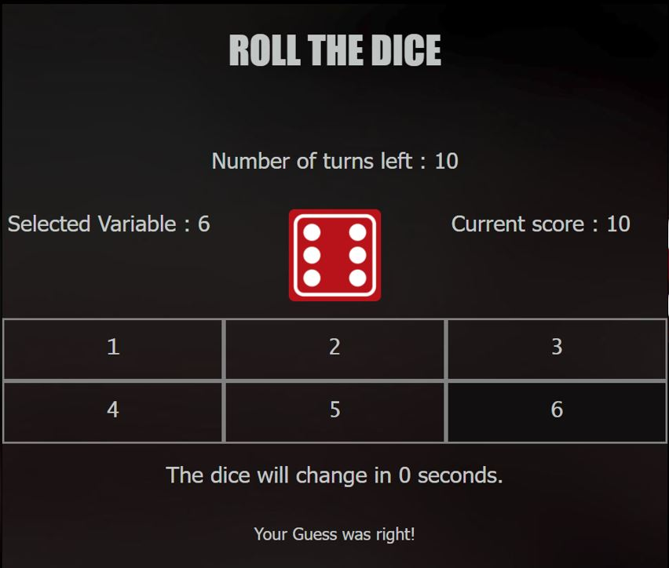
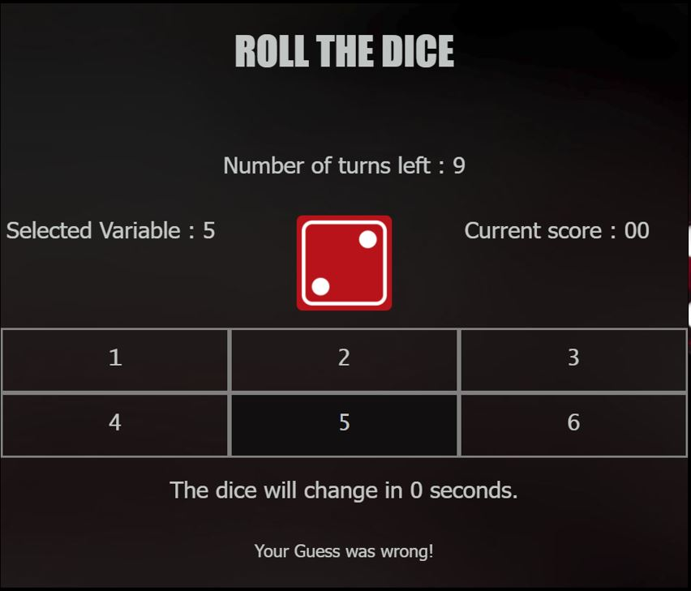
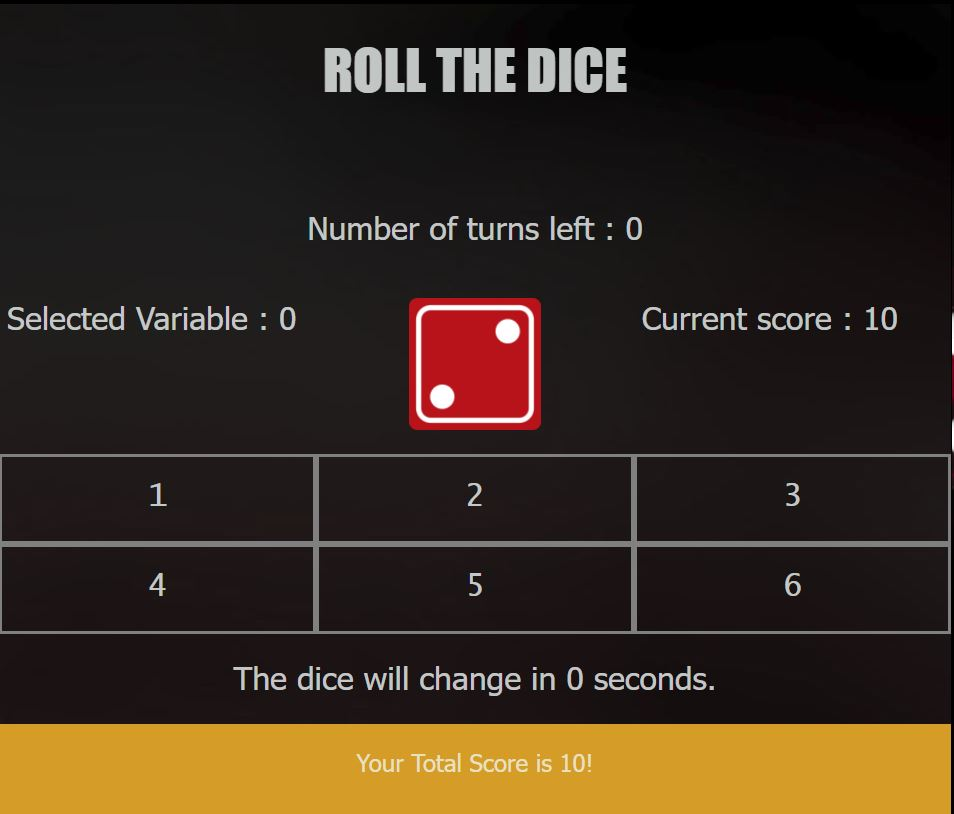

# Getting Started with Roll the dice App
Welcome to Roll the dice App. It's a simple game app built  using HTML, CSS and JavaScript.

## Use a production Version
The production version is hosted at [https://gearman0712.github.io/Curious_jr-s_Dice_game/](https://gearman0712.github.io/Curious_jr-s_Dice_game/)

## Use the development Version

- Clone the project!
- Open the index.html file on any browser.

## Algorithm/Features

- There are 10 rounds.
- Each round you will be given 3 seconds to guess the number.
- After that, the  dice will roll.
- If value guessed matches  with the value on the face of the dice.
- If yes, then the score will increase by 10.
- If no, then the score will remain the same.
- After 10 rounds  the score will be displayed.
  

## ScreenShots 

